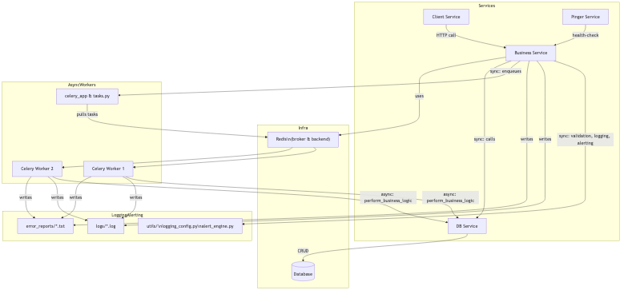

## System Architecture

```mermaid
flowchart TD
  subgraph Infra
    Redis[Redis<br/>(broker & backend)]
    DB[(Database)]
  end
  subgraph Services
    CS[Client Service]
    BS[Business Service]
    DS[DB Service]
    PING[Pinger Service]
  end
  subgraph AsyncWorkers
    CelApp[celery_app & tasks.py]
    W1[Celery Worker 1]
    W2[Celery Worker 2]
  end
  subgraph LoggingAlerting
    utils[utils/\nlogging_config.py\nalert_engine.py]
    Logs[logs/*.log]
    Alerts[error_reports/*.txt]
  end

  CS -->|HTTP call| BS
  BS -->|sync: validation, logging, alerting| utils
  BS -->|writes| Logs
  BS -->|writes| Alerts
  BS -->|sync: enqueues| CelApp
  BS -->|sync: calls| DS
  BS -->|uses| Redis

  CelApp -->|pulls tasks| Redis
  Redis --> W1
  Redis --> W2

  W1 -->|async: perform_business_logic| DS
  W1 -->|writes| Logs
  W1 -->|writes| Alerts

  W2 -->|async: perform_business_logic| DS
  W2 -->|writes| Logs
  W2 -->|writes| Alerts

  DS -->|CRUD| DB
  PING -->|health-check| BS
```

## System Architecture

